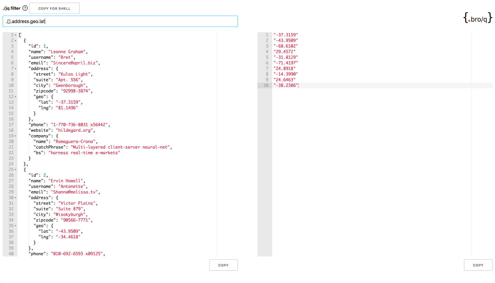
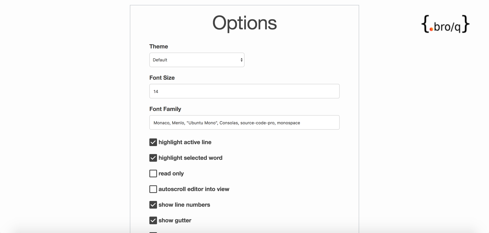

# bro/q


[](https://goo.gl/c8SAF4)


## Chrome Web Store: https://goo.gl/c8SAF4

Chrome Extension for JSON formatting and [jq](https://stedolan.github.io/jq/) filtering in your Browser.

If you want to contribute, please, read our [Contributing](CONTRIBUTING.md) guidelines first.



 

## Features

- deep link using fragments in order to share your [jq](https://stedolan.github.io/jq/) expression
- no need to post your json to any external services for formatting
- open your json file in Chrome (no API needed, local json files are working too)
- search & filtering functionality
- highlighting
- filtering with [jq](https://stedolan.github.io/jq/), no installation needed
- saving commonly used filters for easy access later
- editor customization
- full coverage of [jq](https://stedolan.github.io/jq/) functionality
- create a shell command with your filter and curl
- copy your json file or the filter output to the clipboard

## How to install


Chrome Web Store: https://goo.gl/c8SAF4

or follow this steps:

1. Download the latest [release-XXX](https://github.com/zalando-incubator/bro-q/releases/latest/) version and extract the code.
2. Enable `Developer mode` in `Chrome Settings > Extensions`
3. Click on `Load unpacked extension...` and select the `release-XXX` folder.
4. In the `Options` you can customize the extension.

## Setup

```
$ npm install
```
or
```
$ yarn install
```

## Build

```
$ npm run build
```
or
```
$ yarn build
```

## Dependencies

Name | URL | License
---- | --- | -------
babel-core | https://github.com/babel/babel/tree/master/packages/babel-core | MIT
babel-loader | https://github.com/babel/babel-loader | MIT
babel-preset-env | https://github.com/babel/babel-preset-env | MIT
brace | https://github.com/thlorenz/brace | MIT
copy-webpack-plugin | https://github.com/webpack-contrib/copy-webpack-plugin | MIT
jq-web | https://github.com/fiatjaf/jq-web | ISC
jquery | https://github.com/jquery/jquery | MIT
moment | https://github.com/moment/moment | MIT
wasm-loader | https://github.com/ballercat/wasm-loader | MIT
@types/node | https://github.com/DefinitelyTyped/DefinitelyTyped | MIT
@types/ace | https://github.com/DefinitelyTyped/DefinitelyTyped | MIT
@types/chrome | https://github.com/DefinitelyTyped/DefinitelyTyped | MIT
@types/jquery | https://github.com/DefinitelyTyped/DefinitelyTyped | MIT
css-loader | https://github.com/webpack-contrib/css-loader | MIT
style-loader | https://github.com/webpack-contrib/style-loader | MIT
ts-loader | https://github.com/TypeStrong/ts-loader | MIT
typescript | https://github.com/Microsoft/TypeScript | Apache-2.0
webpack | https://github.com/webpack/webpack | MIT
webpack-cli | https://github.com/webpack/webpack-cli | MIT
chrome-extension-typescript-starter | https://github.com/chibat/chrome-extension-typescript-starter | MIT
ts-clipboard | https://github.com/gforceg/ts-clipboard | MIT
Skeleton | https://github.com/dhg/Skeleton/ | MIT


## Contact

For any inquiry, please contact the [Maintainers](MAINTAINERS).

## LICENSE

The MIT License (MIT) Copyright © 2018 Zalando SE, https://tech.zalando.com

Permission is hereby granted, free of charge, to any person obtaining a copy of this software and associated documentation files (the “Software”), to deal in the Software without restriction, including without limitation the rights to use, copy, modify, merge, publish, distribute, sublicense, and/or sell copies of the Software, and to permit persons to whom the Software is furnished to do so, subject to the following conditions:

The above copyright notice and this permission notice shall be included in all copies or substantial portions of the Software.

THE SOFTWARE IS PROVIDED “AS IS”, WITHOUT WARRANTY OF ANY KIND, EXPRESS OR IMPLIED, INCLUDING BUT NOT LIMITED TO THE WARRANTIES OF MERCHANTABILITY, FITNESS FOR A PARTICULAR PURPOSE AND NONINFRINGEMENT. IN NO EVENT SHALL THE AUTHORS OR COPYRIGHT HOLDERS BE LIABLE FOR ANY CLAIM, DAMAGES OR OTHER LIABILITY, WHETHER IN AN ACTION OF CONTRACT, TORT OR OTHERWISE, ARISING FROM, OUT OF OR IN CONNECTION WITH THE SOFTWARE OR THE USE OR OTHER DEALINGS IN THE SOFTWARE.
